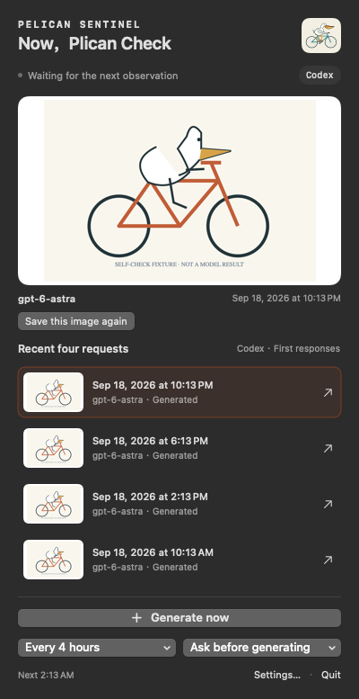
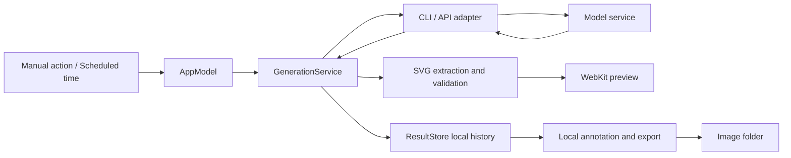

# Pelican Sentinel

**English** | [简体中文](README.zh-CN.md)

## The problem: you use models every day, but rarely check their intelligence over time

You rely on models to write code, analyze problems, and get work done. Yet it is hard to tell whether they keep performing at the level you expect. One poor response might be a fluke. A feeling that a model has become less capable is difficult to investigate without historical results from the same task.

Manual checks mean repeating prompts, recording settings, and saving results. It is also easy to keep only the best attempt. Without a consistent task and a continuous record, changes worth investigating can go unnoticed.

## The solution: monitor model intelligence continuously, starting with one fixed task

**Pelican Sentinel turns model intelligence checks into a scheduled task in your macOS menu bar.** The current version asks a model to draw a pelican riding a bicycle as SVG, using the same prompt every time. Run it manually or every 1, 2, or 4 hours.

The drawing gives you something concrete to inspect: are the pelican and bicycle complete, do their parts fit together, and did the model follow the instruction? The app preserves the first response, model settings, timestamps, and failed attempts, so you can look back through results instead of relying on impressions or scattered screenshots.

The goal is to notice changes in model intelligence over time. Today, the app schedules, generates, and records results; you inspect the drawings yourself. It does not yet score results or alert on changes, and one drawing task cannot represent a model's overall capabilities.


[](LICENSE)
[](https://github.com/LuyuTeaRoom/PelicanSentinel/actions/workflows/ci.yml)

[Quick start](#quick-start) · [Model connections](#model-connections) · [Images and data](#images-and-data) · [How it works](#how-it-works) · [Development](#development)



*Native UI screenshot using self-check fixtures, not actual model output. Select a history row to change the large image; use its arrow to open the corresponding SVG.*

## What you get

- **A continuous observation history** — generate manually or every 1, 2, or 4 hours. The default mode asks before generating.
- **First results preserved** — a fixed prompt, responses, settings, elapsed time, available token usage, and failed attempts.
- **Five connection types** — Codex, OpenAI, Claude, Gemini, and OpenAI-compatible APIs, each with separate settings.
- **Portable images** — export SVGs with the model, completion time, and UTC offset at the bottom to a folder you choose.
- **Local recovery** — retry saving or rebuild previews without requesting another model response.
- **English and Simplified Chinese** — switch in the same app's settings, with shared history, credentials, and scheduling.

Every request uses this prompt:

```text
Generate an SVG of a pelican riding a bicycle
```

## Quick start

You need macOS 13+, Apple's development toolchain, and one usable model connection. The project uses system frameworks, with no third-party Swift package dependencies, `.env` file, or database service.

The locally verified development environment is Apple Silicon, macOS 27, and Apple Swift 6.4. Building requires `swift`, `xcrun`, `iconutil`, and `codesign`; tests require Swift Testing from the toolchain. Hosted CI uses macOS 15 and Xcode 16.4; see [Actions](https://github.com/LuyuTeaRoom/PelicanSentinel/actions/workflows/ci.yml) for run results.

### 1. Build and open

```sh
git clone https://github.com/LuyuTeaRoom/PelicanSentinel.git
cd PelicanSentinel
./scripts/build-app.sh
open "dist/Pelican Sentinel.app"
```

The script builds an `.app` with a local ad-hoc signature and verifies that signature. Click the cycling pelican icon in the menu bar to open the app; there is no regular main window. This release is distributed as source, with no notarized installer.

### 2. Connect a model

The app starts in Simplified Chinese. Open **设置 → 语言**, select **English**, then configure a connection in settings. Enter and save a model ID available to your account.

- **Codex:** use a locally installed and logged-in Codex CLI. The app checks common installation paths; you can also select the executable manually. If the CLI is installed, run `codex login` in a terminal to sign in.
- **API:** save the model configuration, then save the corresponding API key. A compatible connection also needs a base URL such as `http://localhost:11434/v1`; do not append `/chat/completions`.

A CLI marked available in settings means its file is executable, not that authentication or model access has been verified.

### 3. Make your first observation

Return to the menu and generate an image. On success, the large image and recent requests update, and a new export subfolder appears under `~/Pictures/PelicanSentinel/` by default.

Select a history row to inspect that result in the large image. Click its right-hand arrow to open the SVG in Quick Look. The menu shows the four most recent requests for the current provider and model.

For ongoing checks, choose an interval and either ask-before-generation or automatic mode. Scheduling runs only while the app is running; missed intervals are not replayed as a batch of requests.

## Model connections

| Connection | Authentication | Generation route |
| --- | --- | --- |
| Codex | Local CLI login | Temporary `codex exec` session |
| OpenAI API | OpenAI API key | Responses API |
| Claude API | Anthropic API key | Messages API |
| Gemini API | Google AI Studio API key | `generateContent` |
| OpenAI-compatible API | Service key; optional for local services | Chat Completions |

Model IDs are editable. The code prefills `gpt-6-astra` for Codex/OpenAI, `claude-sonnet-5` for Claude, and `gemini-3.8-flash` for Gemini; compatible connections require your own value. **A prefilled name does not guarantee account access.** The app does not fetch remote model lists.

Official API endpoints are fixed. Custom compatible endpoints require HTTPS, except HTTP is allowed for `localhost`, `127.0.0.1`, and `[::1]`. HTTP redirects are rejected. A compatible service must support the app's text Chat Completions requests; support for every protocol extension is not implied.

<details>
<summary>Settings, defaults, and advanced parameters</summary>

Edit these through the settings UI. Each connection stores one model configuration. Switching providers or saving a new model configuration recalculates the next observation time.

| Setting / field | Requirement | Default | Behavior |
| --- | --- | --- | --- |
| Provider / `provider` | Required | `codex` | One active connection at a time |
| Model / `model` | Required | See above | One configuration per provider |
| Language / `language` | Optional | `zh-Hans` | Supports `zh-Hans` and `en` |
| Mode / `mode` | Optional | `ask` | `automatic` requests generation when due |
| Interval / `intervalHours` | Optional | `4` | Choose `1`, `2`, or `4` hours |
| Image folder / `imageSavePath` | Optional | `~/Pictures/PelicanSentinel/` | Used for new exports and save retries; does not move old files |
| CLI path / `codexExecutable` | Required for Codex | Auto-detected | Select an executable in settings |
| Reasoning / `reasoning` | Advanced | `high` for Codex/OpenAI | No reasoning override for other providers; OpenAI `default` omits the parameter |
| Output limit / `outputLimit` | Advanced | `16384` for APIs | Accepts `1…131072`, subject to service limits; Codex records `0` because a limit cannot be enforced |
| Base URL / `baseURL` | Required for compatible APIs | Empty | Example: `http://localhost:11434/v1`, without `/chat/completions` |
| Token limit field / `tokenLimitField` | Advanced, compatible APIs | `max_tokens` | Can use `max_completion_tokens`; must match the service |

Definitions: [AppSettings](Sources/PelicanCore/Models.swift) and [ProviderConfiguration](Sources/PelicanCore/ProviderCatalog.swift).

</details>

## Images and data

### Exported files

Each successful export creates a separate subfolder:

```text
PelicanSentinel-<record ID>/
├── pelican.svg    # Original artwork plus model and time footer
└── pelican.png    # Saved when rendering succeeds; no footer
```

Change the image folder in settings. The new location is used for subsequent exports and save retries. Existing files stay where they are and existing exports are not overwritten.

The footer is added locally to a derived SVG and **uses no additional model tokens**. It labels the model as `Returned model` when the server supplies a model name, or `Requested model` otherwise. The original SVG is preserved; menu images and PNG previews do not receive the footer. Generation itself still uses your selected service's quota.

### Storage locations

| Data | Location |
| --- | --- |
| Settings, request records, responses, original SVGs, preview cache | `~/Library/Application Support/PelicanSentinel/` |
| Exported images | Your chosen folder; defaults to `~/Pictures/PelicanSentinel/` |
| API keys | macOS Keychain, separated by provider and additionally by base URL for compatible connections |

Internal history has a fixed **30-day** retention period. Successful generations with an explicit export failure and no external SVG copy are temporarily retained until saving succeeds. Images in your export folder are not cleaned up by this policy.

History stays local, but generation requests are sent to your selected model service. Stored API responses redact matches of configured keys, and error responses have separate redaction handling.

### Recovering from failures

| Situation | Action |
| --- | --- |
| Saving failed | Fix the folder, select the record, and retry saving the image |
| The record is no longer among the last four | Open the pending image saves section in settings |
| Preview generation failed | Select the record and rebuild its preview; SVG can be saved independently |
| Footer annotation failed | The app exports the original SVG and displays an annotation warning |
| Request failed, was cancelled, or was interrupted | Inspect its status; manually generating again starts a new request |

Save retries and preview rebuilding read local results without calling the model again.

## How it works



`AppModel` coordinates UI, scheduling, and task state; `SchedulePolicy` calculates due times. `GenerationService` saves an execution record before calling the selected `ModelProvider`. The model service performs inference.

`SVGExtractor` extracts the first complete SVG. `SVGValidator` checks format, safety restrictions, and complexity before rendering in WebKit with JavaScript disabled. `ResultStore` saves records and files; `ImageExporter` annotates derived SVGs and exports them separately.

### Deliberate tradeoffs

- **A fixed task and the first response.** This removes manual prompt editing as a variable, at the cost of custom drawing tasks and automatic scoring.
- **Record first; no automatic retry.** Unfinished requests are marked interrupted after restart. An uncertain remote result does not trigger another attempt for the same scheduled slot, so some observations contain only a failure record.
- **Original data and display files are separate.** Previews and annotations can be recovered locally without changing the original SVG, at the cost of additional stored files.
- **One adapter per protocol.** Response parsing can be tested separately. Adding a provider requires code changes; there is no dynamic plugin layer.

See the [architecture](docs/ARCHITECTURE.md) and [CodexBar integration reference](docs/CODEXBAR_REFERENCE.md) for details (in Simplified Chinese).

## Limitations

**This is an observation log for a fixed drawing task, not a model capability ranking.** A single image cannot prove an overall improvement or decline, and execution conditions differ across providers.

- **v0.2.3 is a local macOS MVP.** There is no automatic updater. Compatibility across all supported OS and hardware combinations has not been verified on physical devices.
- Codex arguments depend on the CLI version. Recorded live-request validation used `0.153.4`; the Codex route cannot enforce an output token limit.
- CLI/API requests have a default 120-second timeout. Cancellation or timeout does not prove the remote request was cancelled and may still consume quota. Later scheduled observations are new requests.
- SVG extraction/validation is limited to 2,000,000 UTF-8 bytes, 10,000 nodes, and 64 levels of nesting. Arbitrary SVG content is not supported. PNG previews use a 720×480 WebKit viewport.
- If dimensions cannot be determined safely, the app exports the original SVG without a footer. Completion time is formatted using the machine's time zone at annotation time; the original generation time zone identifier is not stored separately.

## Development

The project has two Swift targets and uses system frameworks:

```text
Sources/PelicanCore/       # Models, providers, scheduling, SVG validation, storage
Sources/PelicanSentinel/   # App entry, menu, settings, coordination, previews, exports
Tests/                    # Core, App, and public export tests
Resources/                # SVG branding, icons, Info.plist
scripts/                  # Build, test, icon generation, public export
docs/                    # Architecture, design references, validation
```

Run from the project root:

```sh
# Swift tests and public export boundary tests
./scripts/test.sh
python3 -m unittest discover -s Tests/ReleaseTests -v

# Release build, packaging, and local signature verification
./scripts/build-app.sh

# UI and image self-check with no model calls
"dist/Pelican Sentinel.app/Contents/MacOS/PelicanSentinel" \
  --self-check --output artifacts/readme-self-check
```

The self-check uses separate data, fixed drawing fixtures, and temporary Keychain entries. Success prints `SELF_CHECK_PASS`. Screenshots and `self-check.txt` are written to the selected folder. A working macOS graphical session is required.

`Package.swift` declares tools version 5.9, while tests require Swift Testing. The locally validated toolchain is Apple Swift 6.4. The [macOS GitHub Actions workflow](https://github.com/LuyuTeaRoom/PelicanSentinel/actions/workflows/ci.yml) runs public export tests, Swift tests, and an app build. There is no separate lint script. `.build/`, `dist/`, and `artifacts/` are excluded from Git.

<details>
<summary>Live Codex check: consumes model quota</summary>

After configuring CLI login, you can run one live generation:

```sh
"dist/Pelican Sentinel.app/Contents/MacOS/PelicanSentinel" \
  --live-codex --output artifacts/live-codex-check
```

This is not the fixture-based self-check. Results go into a separate validation directory.

</details>

### Validation scope

The [validation record](docs/VALIDATION.md) lists reproducible commands, passed checks, and remaining validation work. Live model checks are recorded separately from tests without credentials; passing protocol fixtures does not establish that every real service has been validated.

### Contributing and releases

The following supporting documents are currently in Simplified Chinese:

- [Contributing](CONTRIBUTING.md): development environment, checks, and contribution scope.
- [Security policy](SECURITY.md): report vulnerabilities privately and avoid exposing credentials or history.
- [Changelog](CHANGELOG.md): version behavior and fixes.
- [Release process](docs/RELEASING.md): prepare a public source copy, inspect files, and publish.
- [Asset provenance](docs/ASSETS.md): SVGs, icons, screenshots, and how they are generated.

[Download the source release](https://github.com/LuyuTeaRoom/PelicanSentinel/releases/latest) · [Report a bug](https://github.com/LuyuTeaRoom/PelicanSentinel/issues/new/choose) · [Report a vulnerability privately](https://github.com/LuyuTeaRoom/PelicanSentinel/security/advisories/new)

## License

Released under the [MIT License](LICENSE).
