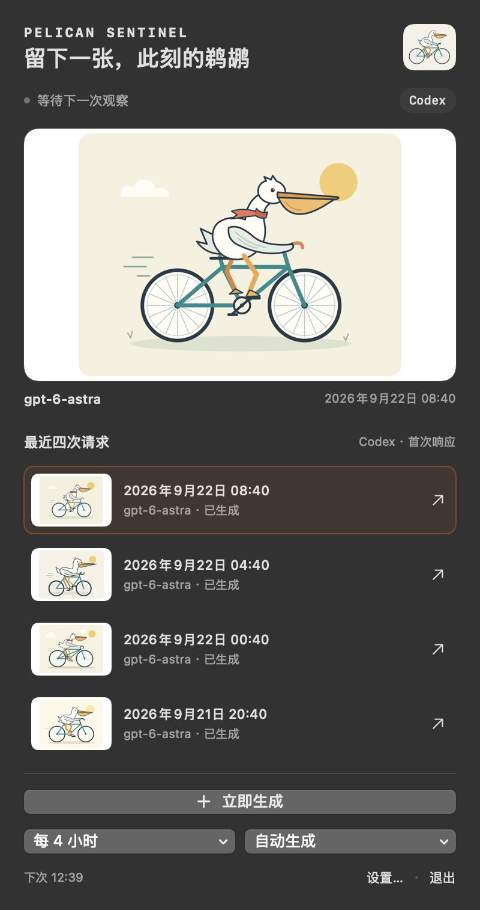
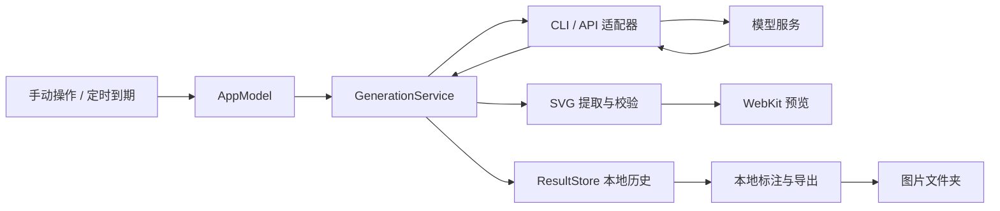

# Pelican Sentinel

[English](README.md) | **简体中文**

## 痛点：模型一直在用，智能表现却缺少持续检查

你每天依赖模型写代码、分析问题、完成任务，却很难判断它是否持续保持你预期的智能水平。一次回答不好，可能只是偶然失误；感觉最近变差了，又缺少相同条件下的历史结果来核对。

手动测试需要反复输入任务、记录参数、保存结果，还容易只留下最好的一次。没有固定任务和连续记录，就难以发现值得进一步验证的表现变化。

## 解决方案：持续检测模型智能程度，从固定任务开始

**Pelican Sentinel 把模型智能检查变成 macOS 菜单栏里的一项定时任务。** 当前版本用同一句提示词，让模型生成“骑自行车的鹈鹕”SVG；每隔 1、2 或 4 小时执行一次，或由你手动触发。

这张图提供一个直观的观察窗口：鹈鹕与自行车是否完整、结构关系是否合理、指令是否被遵循。应用保留首次回复、模型配置、时间和失败状态，让你沿着时间回看输出，而不必依赖印象或零散截图。

目标是持续发现模型智能表现的变化。当前版本负责固定任务、生成和留存，由你查看图片判断差异；尚未实现自动评分或变化告警，也不以单项绘图结果代表模型的全部能力。


[](LICENSE)
[](https://github.com/LuyuTeaRoom/PelicanSentinel/actions/workflows/ci.yml)

[快速开始](#快速开始) · [模型连接](#模型连接) · [图片与数据](#图片与数据) · [工作原理](#工作原理) · [开发](#开发)



*使用本机真实历史记录渲染的中文原生界面。最新请求于 2026 年 9 月 22 日 08:40 开始、08:41 完成（UTC+08:00），通过 Codex 请求 `gpt-6-astra`。选中历史行切换大图，右侧箭头打开对应 SVG。*

## 你会得到什么

- **连续的观察记录** — 手动生成，或每隔 1、2、4 小时生成；默认到期先询问。
- **保留首次结果** — 固定提示词，记录回复、配置、耗时和已知 token 用量，失败尝试也保留。
- **五类模型连接** — Codex、OpenAI、Claude、Gemini、OpenAI 兼容 API，各自保存配置。
- **可带走的图片** — SVG 底部附模型、完成时间和 UTC 偏移，导出到自己选择的文件夹。
- **本地恢复** — 保存失败可补存，预览失败可重建，不会因此再次请求模型。
- **中英文界面** — 在同一个应用的设置中切换语言，共用历史、密钥与调度。

每次发送的提示词相同：

```text
Generate an SVG of a pelican riding a bicycle
```

## 快速开始

需要 macOS 13+、Apple 开发工具链，以及一个可用的模型连接。项目使用系统框架，没有第三方 Swift package 依赖，也不需要 `.env` 或数据库服务。

当前已验证的开发环境是 Apple Silicon、macOS 27、Apple Swift 6.4。构建需要 `swift`、`xcrun`、`iconutil` 和 `codesign`；测试需要工具链自带 Swift Testing。

### 1. 构建并打开

获取源码并在项目根目录执行：

```sh
git clone https://github.com/LuyuTeaRoom/PelicanSentinel.git
cd PelicanSentinel
./scripts/build-app.sh
open "dist/Pelican Sentinel.app"
```

脚本生成并校验本地 ad-hoc 签名的 `.app`。打开后，点击菜单栏的骑车鹈鹕图标进入应用；它没有普通主窗口。当前提供源码构建方式，尚无公证后的分发安装包。

### 2. 连接一个模型

打开 **设置 → 模型接口**，选择连接，填写账号可用的模型 ID 并保存。

- **Codex**：选择已登录的本地 Codex CLI。应用会尝试发现常见安装路径，也可手动指定。已安装 CLI 的用户可在终端执行 `codex login`。
- **API**：保存模型配置后，再保存对应密钥。兼容接口还需填写基础地址，例如 `http://localhost:11434/v1`，不要附加 `/chat/completions`。

设置中的 CLI“可用”表示文件可执行，尚不代表登录和模型权限已验证。

### 3. 留下第一张图

返回菜单，点击 **立即生成**。成功后，大图和最近请求列表会更新，默认图片目录 `~/Pictures/PelicanSentinel/` 中会出现新的导出子目录。

点击一条历史记录，在大图中查看那个时间点的结果；点击该行右侧箭头，在 Quick Look 中打开 SVG 文件。菜单显示当前接口和模型最近四次请求。

需要持续观察时，选择间隔及“生成前询问”或“自动生成”。调度只在应用运行时执行；错过多个周期不会集中补发全部请求。

## 模型连接

| 连接 | 身份验证 | 生成方式 |
| --- | --- | --- |
| Codex | 本地 CLI 登录状态 | 临时 `codex exec` 会话 |
| OpenAI API | OpenAI API key | Responses API |
| Claude API | Anthropic API key | Messages API |
| Gemini API | Google AI Studio API key | `generateContent` |
| OpenAI 兼容 API | 服务密钥；本地可省略 | Chat Completions |

模型 ID 可以修改。代码预填 Codex/OpenAI 的 `gpt-6-astra`、Claude 的 `claude-sonnet-5`、Gemini 的 `gemini-3.8-flash`；兼容接口需要自行填写。**预填名称不代表账号可调用**，应用也不会获取远端模型列表。

官方 API 地址固定。兼容接口的自定义地址要求 HTTPS，仅 `localhost`、`127.0.0.1`、`[::1]` 允许 HTTP；HTTP 重定向被拒绝。兼容服务需支持应用发送的文本 Chat Completions 请求，并非所有协议扩展都适用。

<details>
<summary>设置项、默认值与高级参数</summary>

请通过设置界面修改。各连接保存一份模型配置；切换接口或保存新的模型配置会重新计算下一次观察时间。

| 设置 / 字段 | 类型 | 默认值 | 行为 |
| --- | --- | --- | --- |
| 模型接口 / `provider` | 必选 | `codex` | 一次使用一个连接 |
| 模型 / `model` | 必填 | 见上表 | 各接口分别保存一份配置 |
| 语言 / `language` | 可选 | `zh-Hans` | 支持 `zh-Hans`、`en` |
| 模式 / `mode` | 可选 | `ask` | `automatic` 到期直接请求 |
| 间隔 / `intervalHours` | 可选 | `4` | 可选 `1`、`2`、`4` 小时 |
| 图片目录 / `imageSavePath` | 可选 | `~/Pictures/PelicanSentinel/` | 用于新导出及补存；不搬迁旧文件 |
| CLI 路径 / `codexExecutable` | Codex 必需 | 自动探测 | 可在设置中指定可执行文件 |
| 推理设置 / `reasoning` | 高级 | Codex/OpenAI 为 `high` | 其他接口不发送推理覆盖；OpenAI 的 `default` 表示省略此参数 |
| 输出上限 / `outputLimit` | 高级 | API 为 `16384` | 配置接受 `1…131072`，实际仍受服务限制；Codex 记为 `0`，表示无法强制限制 |
| 基础地址 / `baseURL` | 兼容接口必填 | 空 | 例如 `http://localhost:11434/v1`；不要包含 `/chat/completions` |
| 上限字段 / `tokenLimitField` | 兼容接口高级设置 | `max_tokens` | 可改为 `max_completion_tokens`，需与服务匹配 |

配置定义见 [AppSettings](Sources/PelicanCore/Models.swift) 和 [ProviderConfiguration](Sources/PelicanCore/ProviderCatalog.swift)。

</details>

## 图片与数据

### 保存的文件

一次成功导出会创建独立子目录：

```text
PelicanSentinel-<记录 ID>/
├── pelican.svg    # 原图内容 + 底部模型与时间标注
└── pelican.png    # 渲染成功时保存，无底部标注
```

在 **设置 → 鹈鹕图保存路径** 中更改目录。新目录用于后续导出和补存，旧文件留在原处，已有导出不会被覆盖。

标注在本机写入派生 SVG，**不增加模型 token**。服务器返回模型名称时标为 `Returned model`，否则标为 `Requested model`。原始 SVG 保持不变，菜单图片和 PNG 不添加文字。模型生成本身仍使用所选服务的额度。

### 数据放在哪里

| 数据 | 位置 |
| --- | --- |
| 设置、请求记录、回复、原始 SVG、预览缓存 | `~/Library/Application Support/PelicanSentinel/` |
| 导出图片 | 用户选择的文件夹，默认 `~/Pictures/PelicanSentinel/` |
| API 密钥 | macOS Keychain，按接口隔离；兼容接口再按基础地址隔离 |

内部历史按固定的 **30 天**保留期清理。明确导出失败、且没有外部 SVG 副本的成功记录暂缓清理，补存后恢复正常规则。用户导出目录中的图片不参与清理。

历史保存在本地；生成请求仍会发送给选中的模型服务。API 回复落盘时会脱敏匹配到的配置密钥，错误响应另有脱敏处理。

### 失败后怎么处理

| 情况 | 操作 |
| --- | --- |
| 文件保存失败 | 修正目录后，选中记录并点击“重新保存本图” |
| 失败记录已不在最近四条里 | 打开“设置 → 待保存图片”补存 |
| 预览生成失败 | 选中记录并点击“重新生成预览”；SVG 可独立保存 |
| 底部标注失败 | 应用保留并导出原始 SVG，同时显示标注警告 |
| 请求失败、取消或中断 | 查看该次状态；主动点击“立即生成”会发起新请求 |

补存和重建预览只读取本地结果，不重新调用模型。

## 工作原理



`AppModel` 协调界面、调度和任务状态，`SchedulePolicy` 计算到期时间。`GenerationService` 在请求前保存执行记录，再调用选中的 `ModelProvider`；推理由模型服务完成。

`SVGExtractor` 提取第一个完整 SVG，`SVGValidator` 检查格式、安全限制和复杂度，通过后才交给禁用 JavaScript 的 WebKit 渲染。`ResultStore` 保存记录及文件，`ImageExporter` 负责派生 SVG 的标注和独立导出。

### 几个有意保留的取舍

- **固定任务，保留首次回复。** 少一个手工改写提示词的变量，代价是不能自定义绘图任务，也没有自动评分。
- **先记录，再请求；不自动重试。** 重启后，未完成的请求标为中断。远端结果不确定时不再次消费同一计划时点，代价是这次观察可能只有失败记录。
- **原始数据与展示文件分开。** 预览和标注可在本地恢复，不改变原始 SVG；代价是需要保存额外文件。
- **每种协议一个适配器。** 响应解析可分别测试；新增供应商需要改代码，没有动态插件层。

详细说明见 [架构文档](docs/ARCHITECTURE.md) 和 [CodexBar 接入设计参考](docs/CODEXBAR_REFERENCE.md)。

## 边界

**这是一项固定绘图任务的观察记录，不是模型能力排名。** 单张图片不能证明模型整体能力升降；不同接口的执行条件也不完全相同。

- 当前为 **v0.2.3 本地 MVP**，仅实现 macOS 应用，没有自动更新流程；最低系统版本之外的兼容性尚未逐一实机验证。
- Codex 参数依赖 CLI 版本。仓库记录的真实请求验收使用 `0.153.4`；Codex 路线无法强制设置输出 token 上限。
- CLI/API 默认等待上限为 120 秒。取消或超时不代表远端请求已撤销，仍可能使用额度；后续定时周期属于新的请求。
- SVG 提取/校验限制为 2,000,000 UTF-8 字节、10,000 个节点和 64 层深度，不支持任意 SVG 内容。PNG 是以 720×480 WebKit 视口生成的预览。
- 无法安全确定尺寸时，应用会放弃底部标注并导出原图。完成时间按标注时的本机时区格式化，记录中未独立保存生成当时的时区标识。

## 开发

项目由两个 Swift target 组成，使用系统框架：

```text
Sources/PelicanCore/       # 数据模型、接口适配、调度、SVG 校验与存储
Sources/PelicanSentinel/   # 应用入口、菜单与设置、任务协调、预览与导出
Tests/                    # Core 和 App 两组测试
Resources/                # SVG 品牌资源、图标、Info.plist
scripts/                  # 构建、测试、图标生成
docs/                     # 架构、设计参考和版本验收
```

在项目根目录执行：

```sh
# Swift 测试与公开导出边界测试
./scripts/test.sh
python3 -m unittest discover -s Tests/ReleaseTests -v

# Release 构建、打包和本地签名校验
./scripts/build-app.sh

# 无模型调用的界面与图片自检
"dist/Pelican Sentinel.app/Contents/MacOS/PelicanSentinel" \
  --self-check --output artifacts/readme-self-check
```

自检使用独立数据、固定绘图样例和临时 Keychain 条目，成功时输出 `SELF_CHECK_PASS`。截图与 `self-check.txt` 写入指定目录；需要可用的 macOS 图形会话。

`Package.swift` 声明 tools version 5.9，测试则依赖 Swift Testing；当前验证工具链为 Apple Swift 6.4。仓库提供 macOS GitHub Actions 工作流，运行导出边界测试、Swift 测试及应用构建；没有独立 lint 脚本。托管运行结果见 [GitHub Actions](https://github.com/LuyuTeaRoom/PelicanSentinel/actions/workflows/ci.yml)。`.build/`、`dist/` 和 `artifacts/` 不纳入 Git。

<details>
<summary>真实 Codex 请求检查：会使用模型额度</summary>

已配置 CLI 登录后，可单独执行一次真实生成：

```sh
"dist/Pelican Sentinel.app/Contents/MacOS/PelicanSentinel" \
  --live-codex --output artifacts/live-codex-check
```

这不是无模型自检。结果写入独立验收目录。

</details>

### 验证范围

公开版本的可复现命令、通过结果和待验证事项见 [验证记录](docs/VALIDATION.md)。真实模型调用与无凭据测试分别记录；不将协议样例通过表述为所有真实服务均已验收。

### 参与与发布

- [贡献指南](CONTRIBUTING.md)：开发环境、检查命令和提交范围。
- [安全政策](SECURITY.md)：私密报告安全问题，避免公开凭据或用户历史。
- [版本变更](CHANGELOG.md)：当前版本的行为与修复。
- [发布流程](docs/RELEASING.md)：生成公开源码副本、检查文件及准备 GitHub 首发。
- [素材来源](docs/ASSETS.md)：SVG、图标与界面截图的来源和生成方式。

[下载源码版本](https://github.com/LuyuTeaRoom/PelicanSentinel/releases/latest) · [报告问题](https://github.com/LuyuTeaRoom/PelicanSentinel/issues/new/choose) · [私密报告漏洞](https://github.com/LuyuTeaRoom/PelicanSentinel/security/advisories/new)

## License

本项目采用 [MIT License](LICENSE)。
